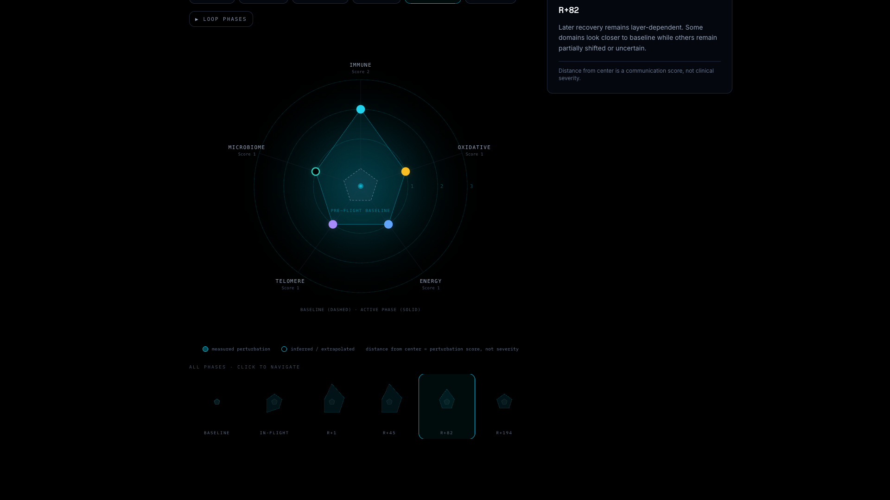

# Body in Orbit

> A communication-safety prototype for post-flight molecular debriefs of Inspiration4 omics data.

**Track 3 — Communication & Visualization** · Torchlight Summit Biosovereignty Hackathon 2026 · Team 3 · Vishnu Mahesha (Rouse High School / Alpha X Program)

🚀 **Live demo:** [body-in-orbit.vercel.app](https://body-in-orbit.vercel.app)
📂 **Repo:** [github.com/vishnumahesha/body-in-orbit](https://github.com/vishnumahesha/body-in-orbit)

---

## Headline Finding

> **The astronaut landed in three days. The biology did not land all at once.**

Across the Inspiration4 crew (n=4), molecular signals shifted in five biological domains and recovered at five different rates. Some markers returned toward baseline by R+82. Others remained perturbed at R+194. The hardest part of communicating this data is not finding signals — it is communicating what they do, and do not, prove.

---

## Mission Context

| Field | Value |
|---|---|
| Mission | Inspiration4 (Sept 2021) |
| Crew | 4 civilians |
| Duration | 71 hours, 49 minutes |
| Orbit altitude | ~585 km |
| Sampling window | 289 days (L-92 → R+194) |
| Data source | NASA Open Science Data Repository (OSDR) / SOMA consortium |

---

## The Living Baseline

The signature figure of this report. Five biological domains × six mission phases. Distance from center is a baseline-relative perturbation score (0–3) — a **communication score, not clinical severity.**



→ View interactive version at [body-in-orbit.vercel.app](https://body-in-orbit.vercel.app)

---

## Findings by Domain

All scores are baseline-relative (this crew member vs. their own pre-flight reference). Not population norms. Not clinical thresholds.

| Domain | R+1 score | R+82 score | Evidence type | Datasets |
|---|---|---|---|---|
| **Immune regulation** | 3 / 3 | 2 / 3 (partial recovery) | Direct (cytokine multiplex, q<0.05) | OSD-575, OSD-656, OSD-570, OSD-569 |
| **Oxidative response** | 2 / 3 | 1 / 3 (layered: 93% EVP recovered, 73% plasma still shifted) | Direct (proteomics, EVP) | OSD-571, OSD-656 |
| **Energy metabolism** | 2 / 3 | 1 / 3 (partial) | Pathway-level (OXPHOS enrichment, immune-cell context) | OSD-575, OSD-571, OSD-569 |
| **Genome / telomere** | 2 / 3 | uncertain (bidirectional, n=4) | Direct (DBS in-flight measurement) | OSD-569, OSD-570 |
| **Microbiome** | 2 / 3 | partial / unresolved | Ecological (16S, metagenomics, host-microbe coupling) | OSD-572, OSD-573, OSD-630, OSD-574 |

→ Full per-claim evidence: [docs/EVIDENCE_LEDGER.md](docs/EVIDENCE_LEDGER.md)

---

## What This Report Does NOT Claim

This is a communication-safety prototype, not a clinical instrument.

- **NOT a diagnosis.** No condition is named or implied.
- **NOT a treatment recommendation.** No interventions are advised.
- **NOT a flight clearance.** No mission readiness is determined here.
- **NOT a forecast.** Recovery patterns from n=4 do not predict individual outcomes.
- **NOT a population norm.** All scores are this astronaut versus their own pre-flight baseline.

Forbidden terms anywhere in astronaut-facing copy: *diagnose, disease, abnormal, dangerous, damaged, treatment, clearance, safe, unsafe, healthy, unhealthy, predicts, clinically significant, pathology, caused by, infection.* These appear only inside explicit "do not conclude" sections.

→ Full design rules: [docs/DESIGN_PHILOSOPHY.md](docs/DESIGN_PHILOSOPHY.md)

---

## Datasets

12 OSDR datasets spanning 5 domains and 10 timepoints (L-92 through R+194):

| OSDR ID | Description | Modality |
|---|---|---|
| OSD-572 | Crew skin/oral/nasal swabs | Microbiome |
| OSD-573 | Dragon capsule swabs | Microbiome (environment) |
| OSD-575 | Serum metabolic panel + cytokine arrays | Metabolomics, immune |
| OSD-571 | Plasma metabolomics, EVP & plasma proteomics | Multi-omics, oxidative |
| OSD-656 | Urine inflammation panel (NULISAseq) | Immune, oxidative |
| OSD-630 | Stool metagenomics | Microbiome |
| OSD-569 | Whole blood profiling (RNA, m6A, CBC) | Multi-omics |
| OSD-570 | PBMC profiling (snRNA, ATAC, VDJ) | Immune, genome |
| OSD-574 | Deltoid skin biopsies + microbiome | Skin, microbiome |

→ Full inventory + data shape per dataset: [data/notebookDatasets.ts](data/notebookDatasets.ts)
→ Analysis methods: [docs/METHODS_NOTE.md](docs/METHODS_NOTE.md) · [analysis/methods_note.md](analysis/methods_note.md)

---

## Source Papers

Eight 2024 SOMA consortium publications:

- Kim et al. *Nat Commun* 2024 — [10.1038/s41467-024-49211-2](https://doi.org/10.1038/s41467-024-49211-2) (immune)
- Houerbi et al. *Nat Commun* 2024 — [10.1038/s41467-024-48841-w](https://doi.org/10.1038/s41467-024-48841-w) (secretome, recovery split)
- Garcia-Medina et al. *Precis Clin Med* 2024 — [10.1093/pcmedi/pbae007](https://doi.org/10.1093/pcmedi/pbae007) (telomere)
- Tierney et al. *Nat Microbiol* 2024 — [10.1038/s41564-024-01635-8](https://doi.org/10.1038/s41564-024-01635-8) (microbiome)
- Park et al. *Nat Commun* 2024 — [10.1038/s41467-024-48625-2](https://doi.org/10.1038/s41467-024-48625-2) (skin spatial)
- Overbey et al. *Nat Commun* 2024 — [10.1038/s41467-024-48806-z](https://doi.org/10.1038/s41467-024-48806-z) (SOMA)
- Overbey et al. *Nature* 2024 — [10.1038/s41586-024-07639-y](https://doi.org/10.1038/s41586-024-07639-y) (SOMA flagship)
- Grigorev et al. *Nat Commun* 2024 — [10.1038/s41467-024-48929-3](https://doi.org/10.1038/s41467-024-48929-3) (direct RNA sequencing)

---

## Design Philosophy

Three principles. Full document at [docs/DESIGN_PHILOSOPHY.md](docs/DESIGN_PHILOSOPHY.md).

1. **Visualize scientific responsibility, not just biology.** Every signal is paired with what it does not prove.
2. **n=4 is not a footnote.** Sample size constrains every score, every claim, every animation. Findings are classified Supported / Monitoring Signal / Overclaim — never as clinical conclusions.
3. **Built for the crew.** Test for every line: could a mission specialist read this and understand what it means for their body?

---

## Interactive Components

The live site has eleven interactive sections, each tied to evidence:

1. **Mission Questions Bar** — four hackathon questions mapped to navigation targets; orients judges instantly
2. **Crew Selector** — pick C001–C004; entire site retargets to that crew's baseline-relative report
3. **The Living Baseline** — slope chart across six mission phases; animated radial phase detail
4. **Personal Debrief** — per-crew Q&A framed around mission planning, not clinical readiness
5. **Evidence Drawers** — per-domain receipts: claim, evidence, q-values, sample size, do-not-conclude
6. **Sample Coverage Matrix** — 12 datasets × 10 timepoints; clearly marks collected data, differential anchors, and gaps
7. **Communication Safety Check** — 10 claim cards; classify each as Supported / Monitoring Signal / Overclaim
8. **Monitoring Planner** — toggle 3-day / 30-day / 180-day mission profiles
9. **Voice Debrief** — approved-script reader, no overclaim insertion
10. **Printable BioBrief** — single-page mission dossier, print-CSS export
11. **Boundary** — explicit statement of what the report does not claim

---

## How to View

**Easiest:** open the live demo at [body-in-orbit.vercel.app](https://body-in-orbit.vercel.app)

**Run locally:**
```bash
git clone https://github.com/vishnumahesha/body-in-orbit
cd body-in-orbit
npm install
npm run dev
# → http://localhost:3000
```

**Reproduce the analysis:** see [analysis/methods_note.md](analysis/methods_note.md) for the OSDR data fetch pattern and notebook export.

---

## AI Usage

Claude (Anthropic) was used as a tool for:
- Translating technical findings into astronaut-facing language
- Auditing every astronaut-facing line against the forbidden-terms list
- Building interactive UI components

Claude was **not** used to:
- Generate biological claims
- Interpret scientific significance
- Decide perturbation scores
- Determine evidence confidence

Every score and every claim traces to a published OSDR dataset and a peer-reviewed paper. AI did not introduce conclusions the source data did not already support.

---

## Project Documents

- [Proposal](docs/proposal.md) — problem statement and approach (Checkpoint 1 artifact)
- [Design Philosophy](docs/DESIGN_PHILOSOPHY.md) — communication-safety design rules
- [Methods Note](docs/METHODS_NOTE.md) — data pipeline, scoring, AI usage, limitations
- [Evidence Ledger](docs/EVIDENCE_LEDGER.md) — every claim traced to dataset and source

---

## Stack

Next.js 14 (App Router) · React 18 · TypeScript · Tailwind · Framer Motion · Three.js / R3F · Unicorn Studio · Vercel

---

## License

MIT — see [LICENSE](LICENSE)

---

> **Cleared for communication. Not cleared for overclaiming.**
> 
